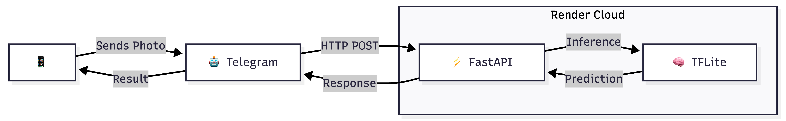

# 👅 DiaTongue - Diabetes Screening via Tongue Analysis

<p align="center">
  
  
  
  
</p>

DiaTongue is an AI-powered diabetes screening tool that analyzes tongue images to detect potential signs of diabetes. The system uses a deep learning model (MobileNetV2) trained on tongue images and is accessible via a Telegram bot.

## 📱 Demo

<!-- Demo Video on YouTube -->
<p align="center">
  <a href="https://youtube.com/shorts/TviM61grFSE">
    
  </a>
</p>


## 🌟 Features

- **AI-Powered Analysis**: Uses MobileNetV2 transfer learning for accurate classification
- **Telegram Bot Interface**: Easy-to-use chat interface for screening
- **Real-time Predictions**: Get results within seconds
- **Confidence Scores**: Each prediction includes a confidence percentage
- **Cloud Deployed**: API hosted on Render for 24/7 availability

## 🏗️ Architecture

<p align="center">
  
</p>

## 📊 Model Performance

| Metric | Value |
|--------|-------|
| **Test Accuracy** | 86% |
| **Training Data** | 2,100 images |
| **Validation Data** | 600 images |
| **Test Data** | 50 images |
| **Base Model** | MobileNetV2 (ImageNet) |
| **Image Size** | 224 x 224 |

### Training Details
- **Optimizer**: Adam (lr=0.0001)
- **Loss Function**: Binary Crossentropy
- **Epochs**: 15
- **Data Augmentation**: Rotation, Zoom, Horizontal Flip

## 🚀 Quick Start

### Prerequisites
- Python 3.11+
- Telegram Bot Token (from [@BotFather](https://t.me/BotFather))

### Installation

1. **Clone the repository**
   ```bash
   git clone https://github.com/NT1906/DiaTongue.git
   cd DiaTongue
   ```

2. **Install dependencies**
   ```bash
   pip install -r requirements.txt
   ```

3. **Configure the bot**
   
   Edit `bot.py` and update:
   ```python
   API_URL = "https://your-app.onrender.com/predict"
   BOT_TOKEN = "your_telegram_bot_token"
   ```

4. **Run locally**
   ```bash
   # Start the API server
   uvicorn app:app --host 0.0.0.0 --port 8000
   
   # In another terminal, start the bot
   python bot.py
   ```

## ☁️ Deployment

### Deploy API to Render

1. Push your code to GitHub
2. Go to [render.com](https://render.com) → New → Web Service
3. Connect your GitHub repo
4. Configure:
   - **Build Command**: `pip install -r requirements.txt`
   - **Start Command**: `uvicorn app:app --host 0.0.0.0 --port $PORT`
5. Deploy!

### Deploy Bot to Render (Optional)

1. Create a new **Background Worker** on Render
2. Use start command: `python bot.py`


## 🔌 API Reference

### POST `/predict`

Analyze a tongue image for diabetes screening.

**Request:**
- `file`: Image file (JPEG/PNG)

**Response:**
```json
{
  "prediction": "Diabetic" | "Non-Diabetic",
  "confidence": 0.85
}
```

**Example:**
```bash
curl -X POST "https://your-app.onrender.com/predict" \
  -F "file=@tongue_image.jpg"
```

## 🤖 Bot Commands

| Command | Description |
|---------|-------------|
| `/start` | Welcome message and usage instructions |
| `/help` | Tips for taking good photos |

## ⚠️ Disclaimer

This tool is for **screening purposes only** and should not be considered a medical diagnosis. Always consult a healthcare professional for proper medical evaluation and diagnosis.

## 🛠️ Technologies Used

- **Deep Learning**: TensorFlow, Keras, MobileNetV2
- **Backend**: FastAPI, Uvicorn
- **Bot**: python-telegram-bot
- **Deployment**: Render
- **Training**: Google Colab (T4 GPU)


## 👨‍💻 Author

**Nisarg** - [@NT1906](https://github.com/NT1906)


